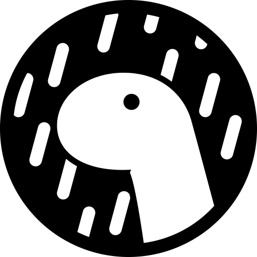

# Hi there, I'm Solus - aka [Sam][youtube] 👋 

## I'm a Student, Developer, and a dude who is working hard!!

- 🌱 I’m currently learning everything 🤣
- 👯 I’m looking to start new projects.
- 🥅 2022 Goals: Learn more about C#
- ⚡ Fun fact: I love to draw and play Piano / drums
- 😻 Check out my portfolio: [Solus](https://nostalgic-liskov-86509c.netlify.app/)

### Connect with me:

&nbsp;&nbsp;

&nbsp;&nbsp;

&nbsp;&nbsp;

&nbsp;&nbsp;

### Languages and Tools:

 
 

---

### 👀 Quick Statistics

<table>
  <tr>
    <td align="center" style="padding=0;width=50%;">
      
    </td>
    <td align="center" style="padding=0;width=50%;">
      
    </td>
  </tr>
</table>

[website]: https://nostalgic-liskov-86509c.netlify.app/
[course]: http://vsCodeHero.com
[twitter]: https://twitter.com/codeSTACKr
[youtube]: https://youtube.com/codeSTACKr
[instagram]: https://instagram.com/codeSTACKr
[linkedin]: https://linkedin.com/in/codeSTACKr
[webdevplaylist]: https://www.youtube.com/playlist?list=PLkwxH9e_vrAJ0WbEsFA9W3I1W-g_BTsbt
[jsplaylist]: https://www.youtube.com/playlist?list=PLkwxH9e_vrALRJKu7wfXby3MKeflhTu6B
[cssplaylist]: https://www.youtube.com/playlist?list=PLkwxH9e_vrALSdvZuEh6gqQdmDoDIoqz4
[reactplaylist]: https://www.youtube.com/playlist?list=PLkwxH9e_vrAK4TdffpxKY3QGyHCpxFcQ0
